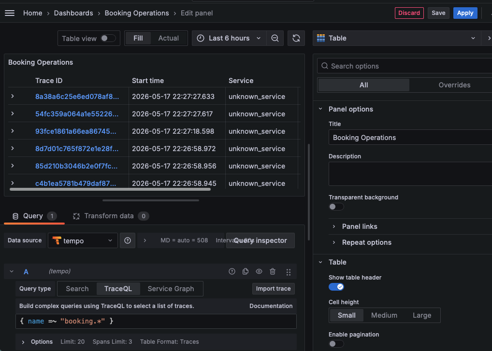
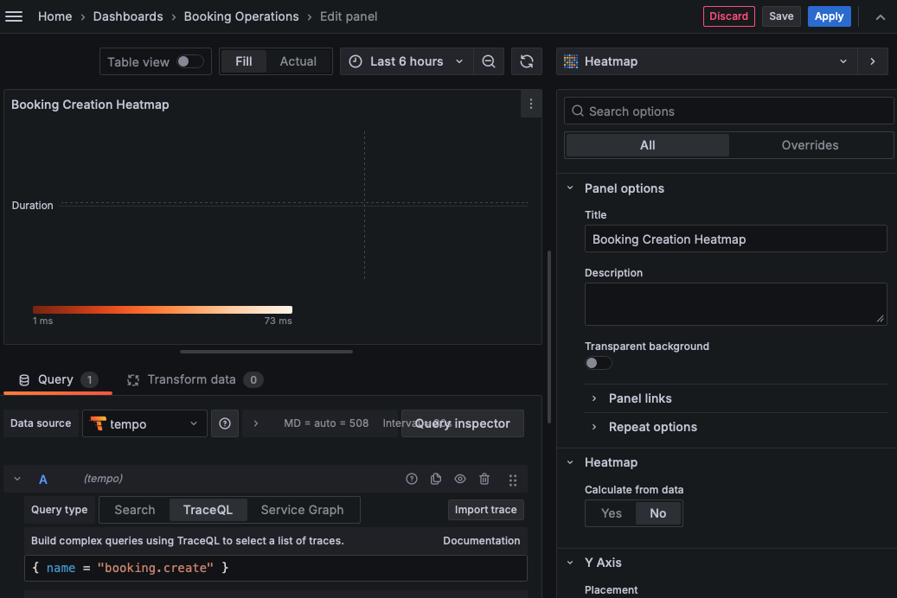
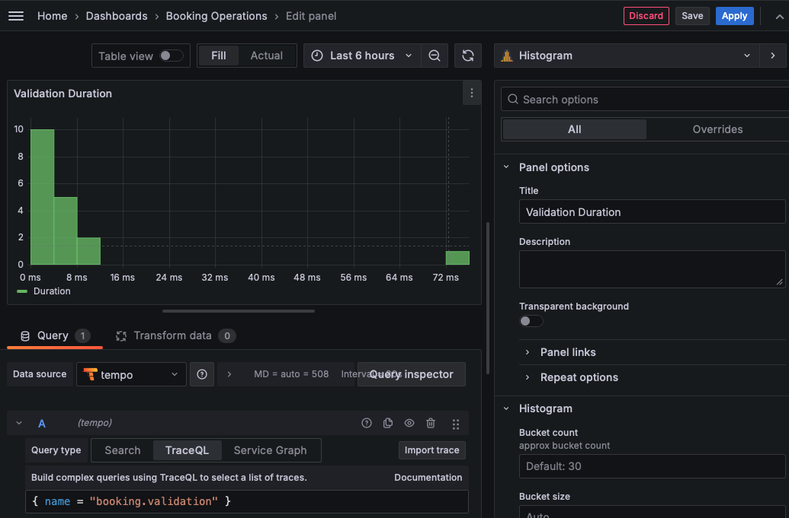
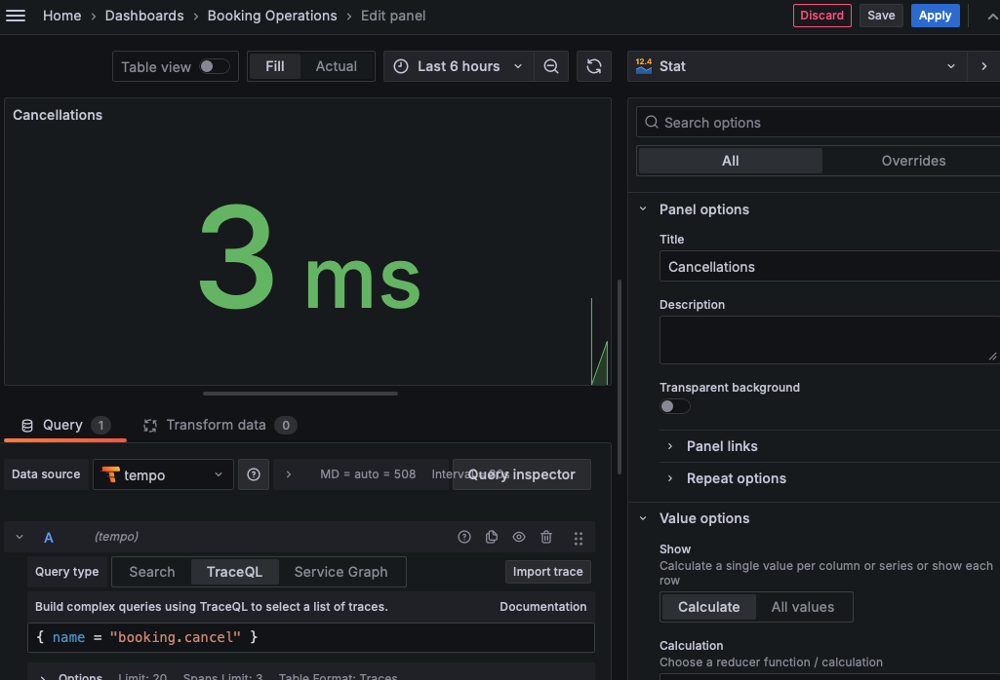

# Учебный проект: Бронирование переговорных комнат

## Описание проекта

Сервис для бронирования переговорных комнат. Проект демонстрирует подход API First — сначала разрабатывается 
спецификация OpenAPI, а затем на её основе генерируется код.

### Возможности API

- **Просмотр списка переговорных комнат** — получение списка всех доступных комнат с информацией о вместимости и оснащении
- **Проверка занятости** — просмотр забронированных слотов для конкретной комнаты на выбранную дату
- **Создание бронирования** — запись переговорной комнаты на определённое время для пользователя
- **Управление бронированиями** — просмотр деталей и отмена существующих записей

## Технологии

- **OpenAPI 3.0.3** — спецификация API
- **Java 21** + **Spring Boot 3** — реализация сервиса
- **Maven** — сборка проекта
- **OpenAPI Generator** — генерация кода из спецификации

## Трассировка

### Схема работы

```
meeting-rooms (Spring Boot 3 + OTel SDK)
OTLP/HTTP :4318 → Grafana Tempo → Grafana Explore (TraceQL)
```

Каждый входящий HTTP запрос порождает корневой спан. Бизнес-операции вручную обёрнуты в дочерние именованные спаны через Micrometer `Observation` API.

### Стек трассировки

- **Micrometer Tracing + OpenTelemetry** — создание и экспорт спанов
- **Grafana Tempo** — хранение трейсов
- **Grafana** — визуализация, дашборды
- **TraceQL** — язык запросов

### Сбор и хранение

Трейсы собираются через OpenTelemetry Protocol (OTLP) и сохраняются в Grafana Tempo.

### Визуализация и дашборды

В Grafana созданы дашборды для анализа бизнес-показателей:

### Доступ к сервисам

| Сервис | URL | Описание |
|--------|-----|----------|
| Приложение | http://localhost:8080 | API сервер |
| Tempo | http://localhost:3200 | Хранилище трейсов |
| Tempo OTLP | http://localhost:4318 | Приём трейсов |
| Grafana | http://localhost:3001 | Дашборды |

### Настройка

```properties
management.tracing.sampling.probability=1.0
management.otlp.tracing.endpoint=http://localhost:4318/v1/traces
management.metrics.tags.application=meeting-rooms
```

### Кастомные спаны

Бизнес-операции обёрнуты в спаны через `Observation` API:

```java
// Валидация бронирования
Observation validationSpan = Observation.createNotStarted("booking.validation", observationRegistry)
        .lowCardinalityKeyValue("room.id", bookingRequest.getRoomId().toString())
        .start();

// Создание бронирования
Observation creationSpan = Observation.createNotStarted("booking.create", observationRegistry)
        .start();

// Отмена бронирования
Observation cancellationSpan = Observation.createNotStarted("booking.cancel", observationRegistry)
        .lowCardinalityKeyValue("booking.id", bookingId.toString())
        .start();
```

| Спан | Назначение |
|------|------------|
| `booking.validation` | Валидация запроса |
| `booking.create` | Создание бронирования |
| `booking.cancel` | Отмена бронирования |

### Дашборды

*Все трейсы сервиса*

*Создание бронирований*

*Длительность валидации*

*Отмены бронирований*


### Корреляция с логами

Формат лога включает `traceId` — Grafana показывает ссылку на трейс в Tempo прямо из строки лога.

### Запуск

```bash
docker compose -f docker-compose.observability.yml up -d
```
