# Учебный проект: Бронирование переговорных комнат

## Описание проекта

Сервис для бронирования переговорных комнат. Проект демонстрирует подход API First — сначала разрабатывается 
спецификация OpenAPI, а затем на её основе генерируется код.

### Возможности API

- **Просмотр списка переговорных комнат** — получение списка всех доступных комнат с информацией о вместимости и оснащении
- **Проверка занятости** — просмотр забронированных слотов для конкретной комнаты на выбранную дату
- **Создание бронирования** — запись переговорной комнаты на определённое время для пользователя
- **Управление бронированиями** — просмотр деталей и отмена существующих записей

## Технологии

- **OpenAPI 3.0.3** — спецификация API
- **Java 21** + **Spring Boot 3** — реализация сервиса
- **Maven** — сборка проекта
- **OpenAPI Generator** — генерация кода из спецификации

## Логирование

### Стек логирования

- **Promtail** — агент для сбора логов из файлов контейнеров
- **Grafana Loki** — хранилище логов с эффективной индексацией по лейблам
- **VictoriaLogs** — альтернативное легковесное хранилище логов
- **Grafana** — визуализация логов через datasource Loki и язык запросов LogQL

### Доступ к сервисам логирования

| Сервис | URL | Описание |
|--------|-----|----------|
| Приложение | http://localhost:8080 | API сервер (пишет логи в `logs/booking-service.log`) |
| Loki | http://localhost:3100 | Хранилище логов |
| Loki API | http://localhost:3100/loki/api/v1/query_range | Запросы к логам через HTTP API |
| VictoriaLogs | http://localhost:9428 | Альтернативное хранилище логов |
| VictoriaLogs VMUI | http://localhost:9428/select/vmui | Web UI для запросов к логам |
| Grafana | http://localhost:3000 | Дашборды и логи (логин: admin / admin) |

Приложение Spring Boot записывает структурированные логи в файл `logs/booking-service.log`.
Promtail считывает этот файл, парсит записи и отправляет в Loki.
Просмотр и анализ логов выполняется в Grafana через LogQL-запросы.

### Что логируется
| Событие | Уровень | Пример сообщения |
|---------|---------|------------------|
| Запрос на создание бронирования | INFO | `Booking request received: roomId=1, startTime=..., endTime=..., title=...` |
| Успешное создание бронирования | INFO | `Booking created successfully: bookingId=1, roomId=1` |
| Ошибка создания бронирования | ERROR | `Failed to create booking: roomId=1, error=...` |
| Запрос на отмену бронирования | INFO | `Booking cancellation requested: bookingId=1` |
| Успешная отмена бронирования | INFO | `Booking cancelled successfully: bookingId=1` |
| Ошибка отмены бронирования | ERROR | `Failed to cancel booking: bookingId=1, error=...` |
| Просмотр бронирования | DEBUG | `Get booking requested: bookingId=1` |

### LogQL запросы на дашборде

| Панель | Тип | LogQL запрос |
|--------|-----|--------------|
| Все логи приложения | Logs | `{app="booking-service"}` |
| Частота логов по уровням | Time Series | `sum by (level) (count_over_time({app="booking-service"}[1m]))` |
| Ошибки и предупреждения | Logs | `{app="booking-service"} \|~ "(?i)(error\|warn\|failed)"` |
| Операции бронирования | Logs | `{app="booking-service"} \|= "Booking"` |
| Бронирований в минуту | Time Series | `count_over_time({app="booking-service"} \|= "Booking created successfully"[1m])` |
| Отмен в минуту | Time Series | `count_over_time({app="booking-service"} \|= "Booking cancelled"[1m])` |

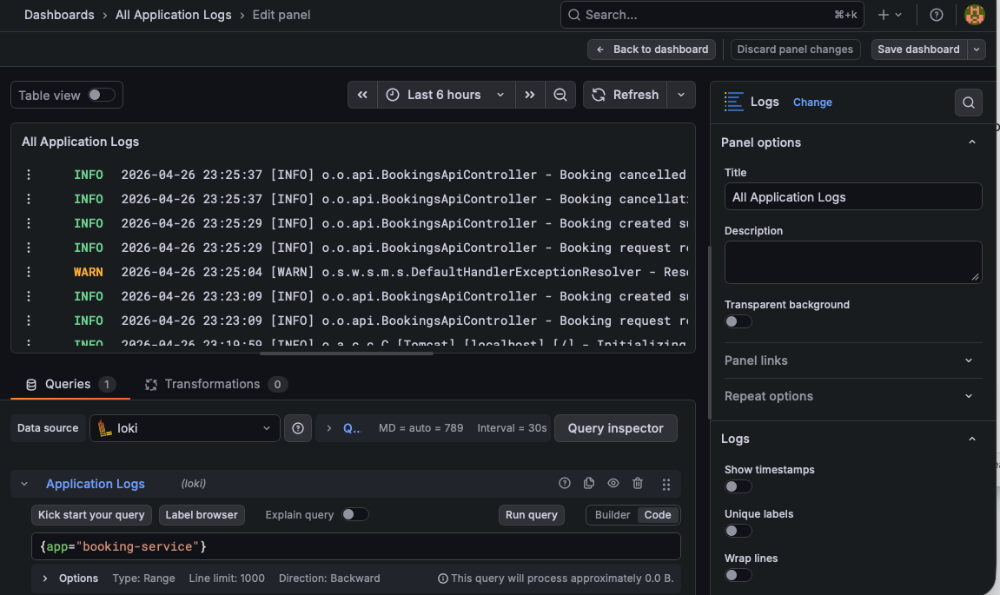
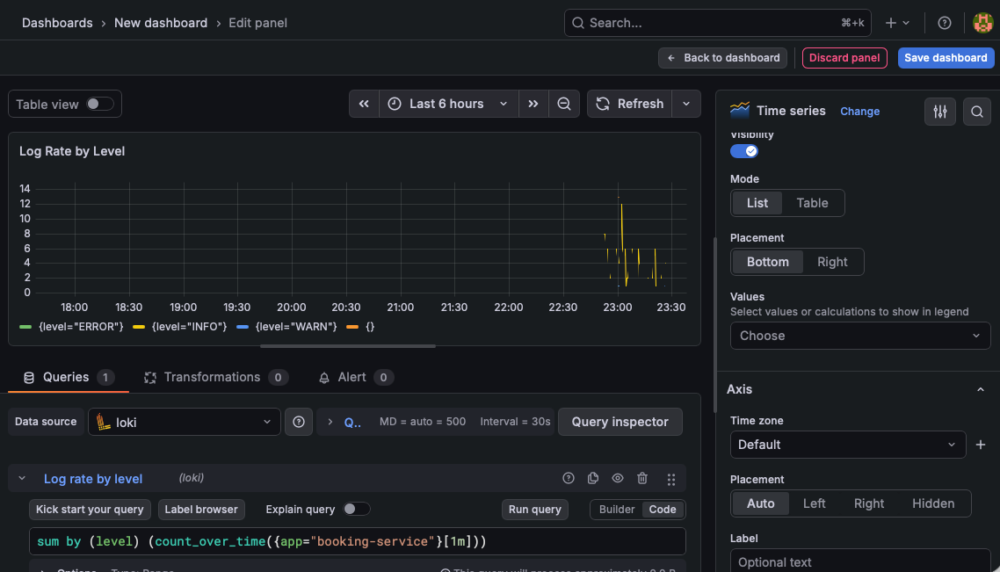
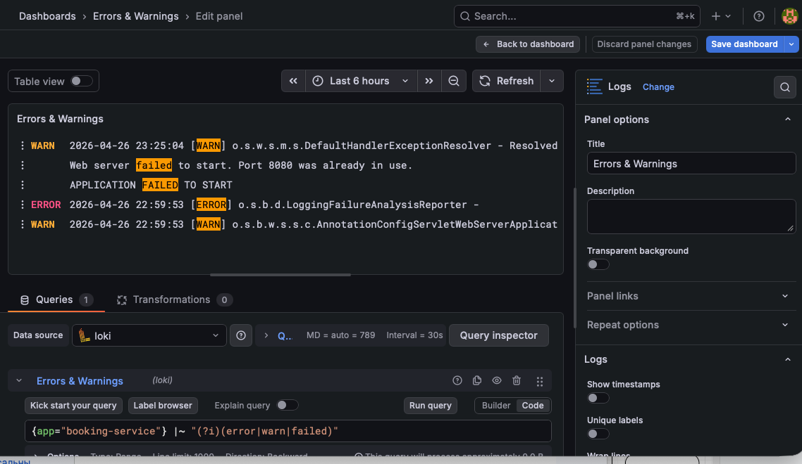
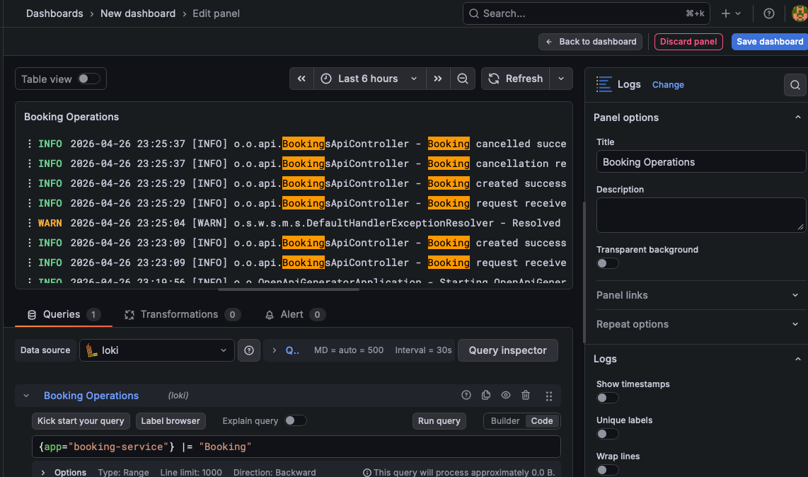
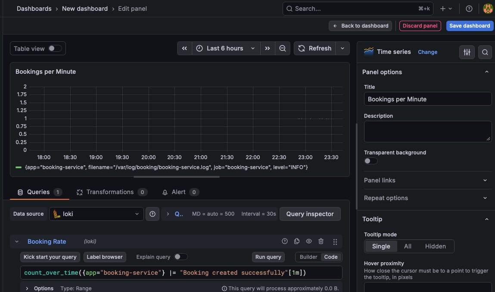
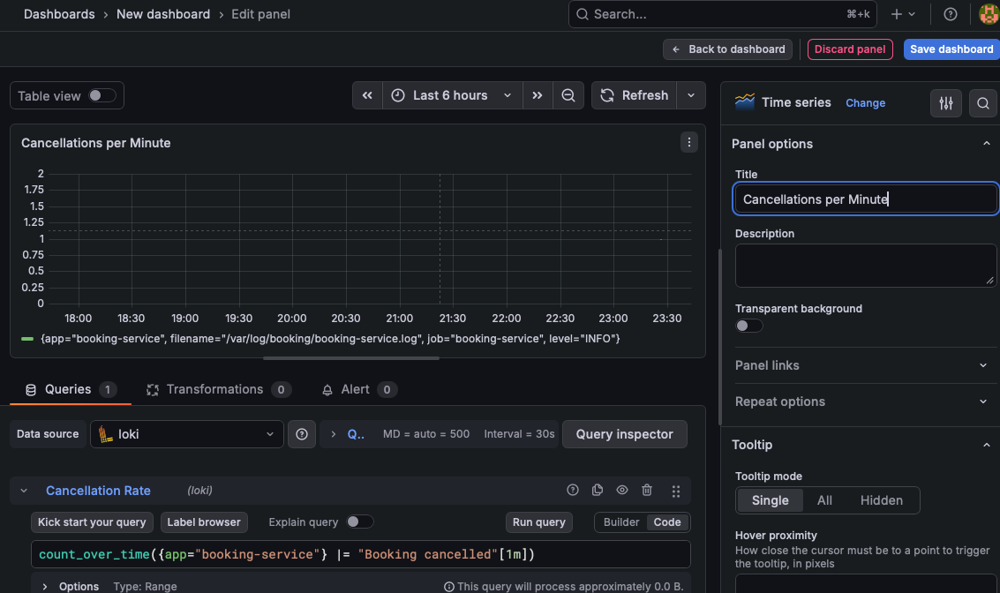

### Логирование в коде
Логи добавлены в контроллеры `BookingsApiController` и `RoomsApiController`:

### Запуск стека логирования
```bash
docker compose -f docker-compose.observability.yml up -d
```

### VictoriaLogs (альтернативное хранилище)

VictoriaLogs запущен как дополнительное хранилище логов с собственным Web UI.

**Web UI:** http://localhost:9428/select/vmui

**Пример запроса:**
```
app="booking-service" AND message:~"Booking"
```

---
## Метрики и мониторинг

### Стек мониторинга
- **Prometheus** — сбор и хранение метрик (TSDB)
- **Grafana** — визуализация и дашборды
- **Spring Boot Actuator + Micrometer** — экспорт метрик из приложения

### Доступ к сервисам

| Сервис | URL | Описание |
|--------|-----|----------|
| Приложение | http://localhost:8080 | API сервер |
| Метрики | http://localhost:8080/actuator/prometheus | Prometheus-метрики |
| Prometheus | http://localhost:9090 | UI для запросов к метрикам |
| Grafana | http://localhost:3000 | Дашборды (логин: admin / admin) |

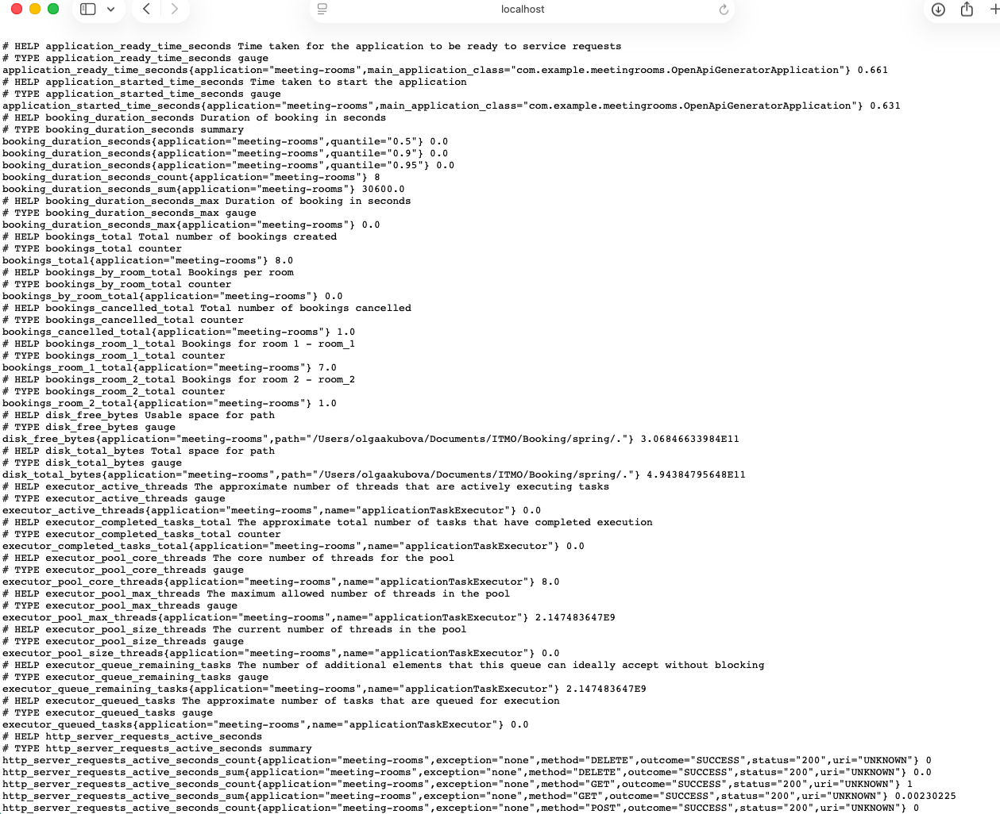

### Продуктовые метрики

| Метрика | Тип | Описание |
|---------|-----|----------|
| `bookings_total` | Counter | Общее количество созданных бронирований |
| `bookings_cancelled_total` | Counter | Общее количество отменённых бронирований |
| `booking_duration_seconds` | Histogram | Длительность бронирования (p50, p90, p95) |
| `bookings.room.{id}` | Counter | Количество бронирований по комнатам |

### PromQL запросы на дашборде

| График | PromQL запрос |
|--------|---------------|
| Всего бронирований | `bookings_total` |
| Бронирований в минуту | `rate(bookings_total[1m])` |
| Процент отмен | `(bookings_cancelled_total / bookings_total) * 100` |

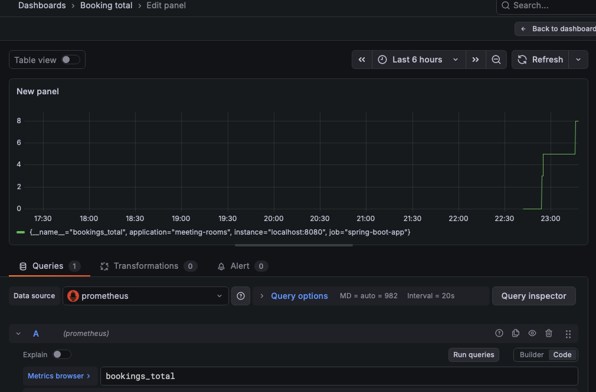
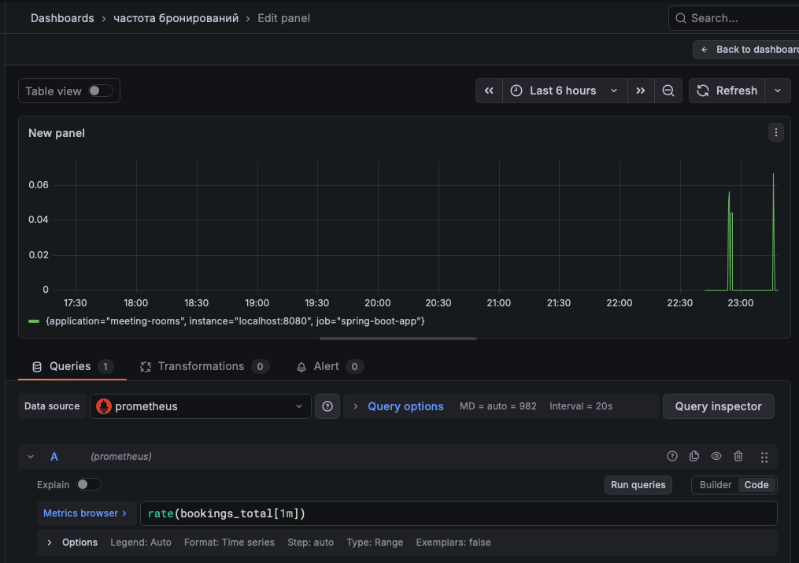
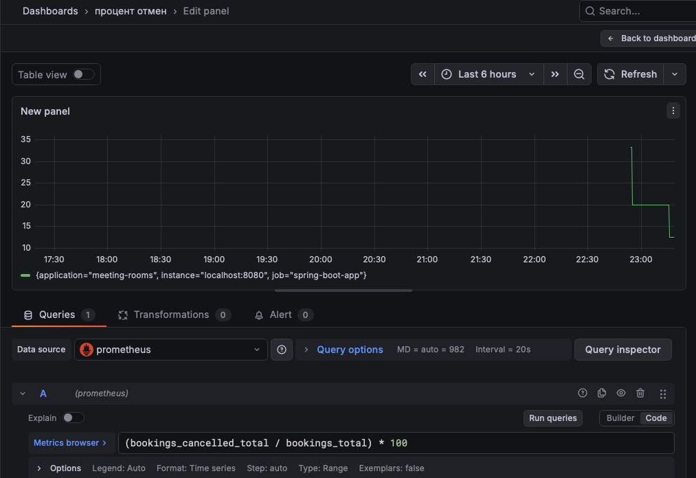

В Prometheus
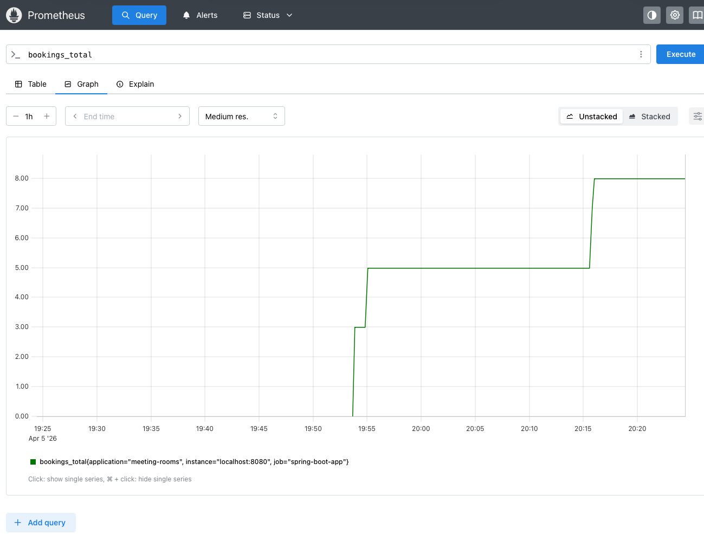

### Запуск стека мониторинга

1. **Запустить Prometheus** (с конфигом `prometheus.yml`):
```bash
prometheus --config.file=prometheus.yml
```
2. Запустить Grafana:
```bash
brew services start grafana  # macOS
# или
docker run -d -p 3000:3000 grafana/grafana
```
3. Настроить источник данных в Grafana:
- URL: http://localhost:9090
- Тип: Prometheus

## Swagger UI

При запуске проекта доступ по url:
http://localhost:8080/swagger-ui/index.html

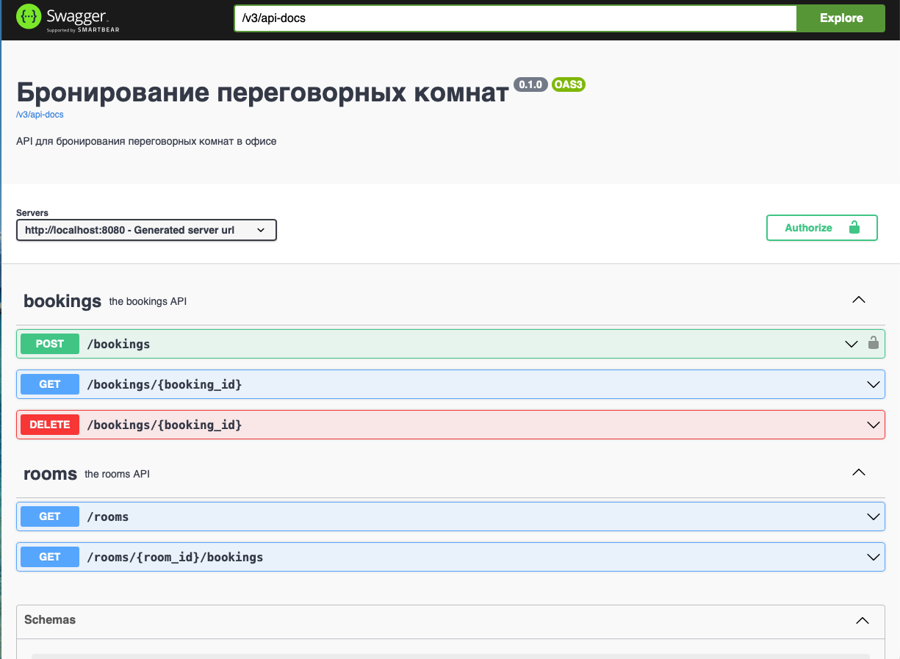

## Особенность проекта: API First подход

Главная особенность этого проекта — строгое следование методологии **API First**:

1. **Сначала спецификация** — разработка началась с создания файла `meeting_rooms.yaml`, в котором описан контракт API: эндпоинты, модели данных, коды ответов
2. **Генерация кода** — на основе спецификации с помощью OpenAPI Generator создан скелет приложения:
   ```bash
   ./generate.sh
   ```
   Скрипт использует Docker-образ `openapitools/openapi-generator-cli` для генерации Spring Boot проекта
3. **Реализация логики** — в сгенерированную структуру добавляется бизнес-логика, при этом все изменения вносятся только в созданные вручную контроллеры, а сгенерированные интерфейсы и модели остаются нетронутыми

## Запуск проекта

### Предварительные требования
- Java 21 или выше
- Maven
- Docker (только для генерации кода)

### Шаги для запуска

1. **Клонировать репозиторий**
   ```bash
   git clone https://github.com/OlgaRhythm/edu-proj-first-api-booking.git
   cd edu-proj-first-api-booking
   ```

2. **Сгенерировать код (опционально, если не использовать готовый)**
   ```bash
   chmod +x generate.sh
   ./generate.sh
   ```

3. **Перейти в папку с проектом**
   ```bash
   cd spring
   ```

4. **Запустить приложение**
   ```bash
   mvn spring-boot:run
   ```

5. **Открыть в браузере**
    - Swagger UI: http://localhost:8080/swagger-ui/index.html
