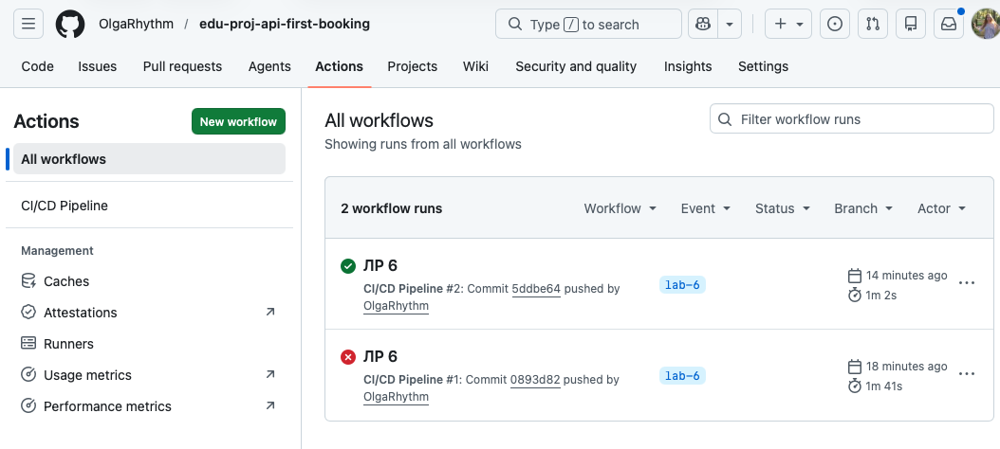
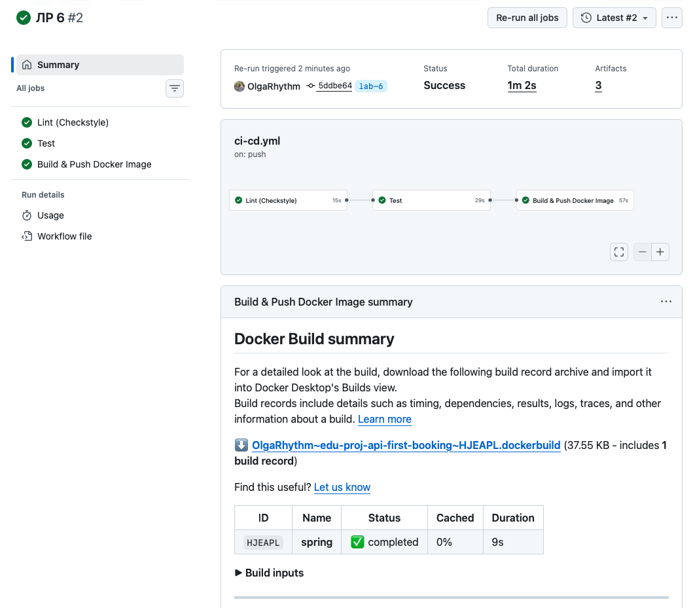
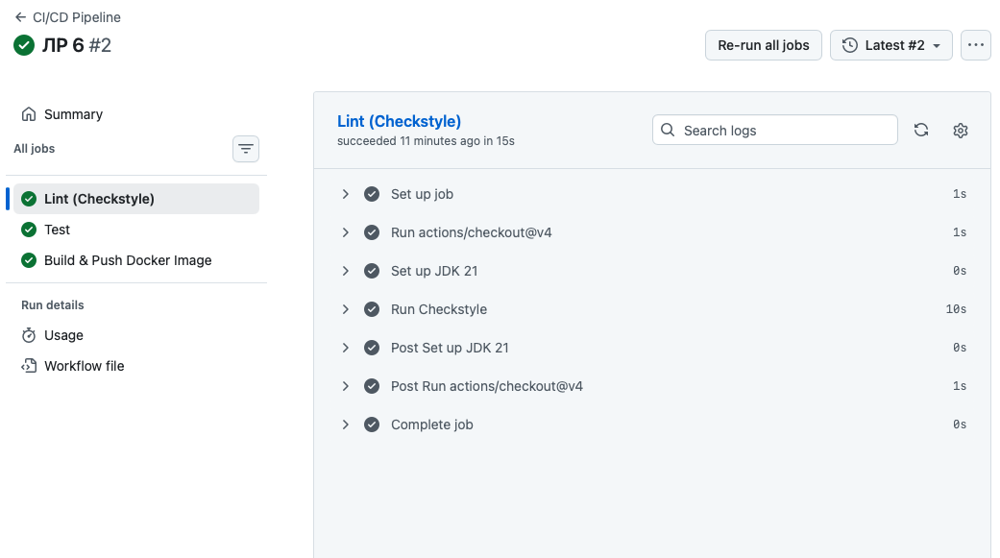
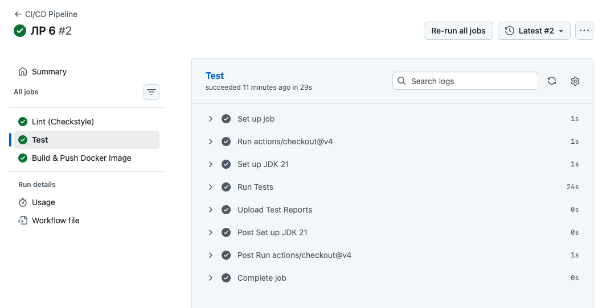
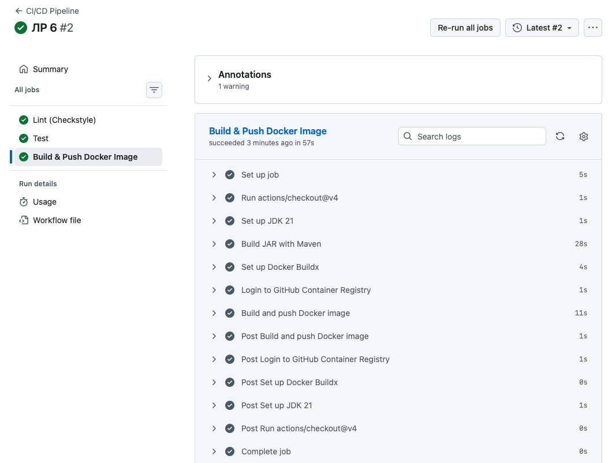

# Учебный проект: Бронирование переговорных комнат

## Описание проекта

Сервис для бронирования переговорных комнат. Проект демонстрирует подход API First — сначала разрабатывается 
спецификация OpenAPI, а затем на её основе генерируется код.

### Возможности API

- **Просмотр списка переговорных комнат** — получение списка всех доступных комнат с информацией о вместимости и оснащении
- **Проверка занятости** — просмотр забронированных слотов для конкретной комнаты на выбранную дату
- **Создание бронирования** — запись переговорной комнаты на определённое время для пользователя
- **Управление бронированиями** — просмотр деталей и отмена существующих записей

## Технологии

- **OpenAPI 3.0.3** — спецификация API
- **Java 21** + **Spring Boot 3** — реализация сервиса
- **Maven** — сборка проекта
- **OpenAPI Generator** — генерация кода из спецификации

## CI/CD

#### Структура пайплайна:
1. Lint
- Проверка стиля кода с помощью Maven Checkstyle Plugin.
- Используется конфигурация google_checks.xml.
- Запускается при каждом пуше и pull request.
2. Test
- Прогон unit-тестов приложения через mvn test.
3. Build
- Сборка JAR-файла приложения через mvn package.
- Сборка Docker-образа на основе eclipse-temurin:21-jre-alpine.
- Пуш образа в GitHub Container Registry (ghcr.io) с тегом dev.
- Использование Docker Buildx для сборки.

